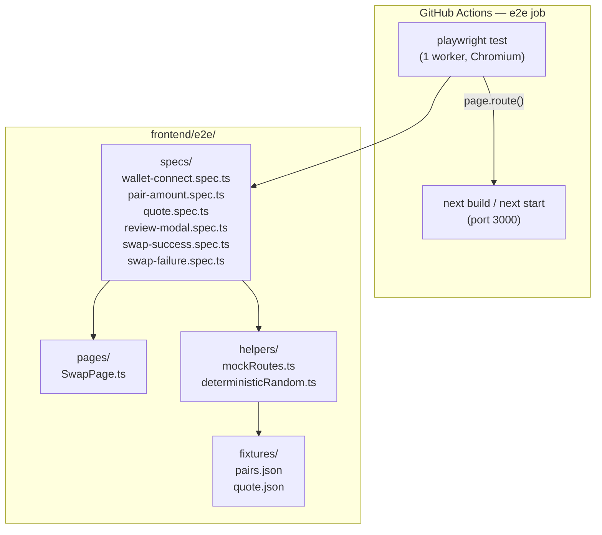

# Design Document: E2E Wallet Swap Flow

## Overview

This design covers adding a Playwright-based end-to-end test suite to the StellarRoute frontend.
The suite validates the primary user journey: connecting a wallet stub, selecting a trading pair,
entering a sell amount, fetching a quote, opening the confirmation modal, and completing (or
failing) the swap. All external HTTP calls are intercepted by Playwright route handlers so tests
run deterministically without a live backend.

The key challenge is the non-deterministic `Math.random() > 0.2` branch in `DemoSwap.handleConfirm`.
The design patches `Math.random` via `page.addInitScript` before each test to force a predictable
outcome, keeping the happy-path and failure-path tests fully deterministic.

## Architecture



The suite is self-contained under `frontend/e2e/`. Tests import a `SwapPage` page-object that
wraps all locator logic, keeping specs readable. A `mockRoutes` helper registers the two
Playwright route intercepts (pairs + quote) and is called from a shared `beforeEach` fixture.

## Components and Interfaces

### playwright.config.ts

Located at `frontend/playwright.config.ts`. Key settings:

- `baseURL`: `http://localhost:3000`
- `testDir`: `./e2e`
- `outputDir`: `./playwright-report`
- `screenshot`: `only-on-failure`
- `trace`: `retain-on-failure`
- `workers`: `1` (CI determinism; overridable locally)
- `webServer`: starts `next start` on port 3000 (requires a prior `next build`)
- Projects: single `chromium` project for CI; local config can add `firefox`/`webkit`

```ts
// frontend/playwright.config.ts (outline)
import { defineConfig, devices } from '@playwright/test';

export default defineConfig({
  testDir: './e2e',
  outputDir: './playwright-report',
  fullyParallel: false,
  workers: process.env.CI ? 1 : undefined,
  reporter: [['html', { open: 'never' }], ['list']],
  use: {
    baseURL: 'http://localhost:3000',
    screenshot: 'only-on-failure',
    trace: 'retain-on-failure',
  },
  projects: [{ name: 'chromium', use: { ...devices['Desktop Chrome'] } }],
  webServer: {
    command: 'npm run start',
    url: 'http://localhost:3000',
    reuseExistingServer: !process.env.CI,
  },
});
```

### SwapPage (Page Object)

`frontend/e2e/pages/SwapPage.ts` — encapsulates all locators and high-level actions.

```ts
interface SwapPage {
  // Locators
  connectButton: Locator
  walletAddress: Locator
  maxButton: Locator
  pairSelect: Locator
  sellAmountInput: Locator
  validationError: Locator
  estimatedReceive: Locator
  refreshQuoteButton: Locator
  reviewSwapButton: Locator
  // Modal locators
  confirmSwapButton: Locator
  cancelButton: Locator
  doneButton: Locator
  dismissButton: Locator
  modalYouPay: Locator
  modalYouReceive: Locator
  modalRate: Locator
  modalFee: Locator
  modalRoute: Locator
  modalStatus: (status: string) => Locator

  // Actions
  connectWallet(): Promise<void>
  selectPair(label: string): Promise<void>
  enterSellAmount(amount: string): Promise<void>
  clickReviewSwap(): Promise<void>
  confirmSwap(): Promise<void>
}
```

### mockRoutes helper

`frontend/e2e/helpers/mockRoutes.ts` — registers Playwright route intercepts.

```ts
async function applyDefaultMocks(page: Page): Promise<void>
async function applyQuoteOverride(page: Page, fixture: Partial<PriceQuote>): Promise<void>
```

`applyDefaultMocks` intercepts:
- `**/api/v1/pairs` → `fixtures/pairs.json`
- `**/api/v1/quote/**` → `fixtures/quote.json`

Any request to an unmatched path causes the test to fail via a catch-all `page.route('**', ...)` 
that calls `route.abort()` and throws a descriptive error (Requirement 2.5).

### deterministicRandom helper

`frontend/e2e/helpers/deterministicRandom.ts` — injects a deterministic `Math.random` override
before page load using `page.addInitScript`.

```ts
// Forces Math.random() to always return `value` for the lifetime of the page
async function patchMathRandom(page: Page, value: number): Promise<void>
```

- Happy path: `patchMathRandom(page, 0.9)` → `0.9 > 0.2` → success
- Failure path: `patchMathRandom(page, 0.1)` → `0.1 > 0.2` is false → failure

### Fixtures

`frontend/e2e/fixtures/pairs.json`:
```json
{
  "pairs": [
    {
      "base": "XLM",
      "counter": "USDC",
      "base_asset": "native",
      "counter_asset": "USDC:GA5ZSEJYB37JRC5AVCIA5MOP4RHTM335X2KGX3IHOJAPP5RE34K4KZVN",
      "offer_count": 42,
      "base_decimals": 7
    }
  ],
  "total": 1
}
```

`frontend/e2e/fixtures/quote.json`:
```json
{
  "base_asset": { "asset_type": "native" },
  "quote_asset": {
    "asset_type": "credit_alphanum4",
    "asset_code": "USDC",
    "asset_issuer": "GA5ZSEJYB37JRC5AVCIA5MOP4RHTM335X2KGX3IHOJAPP5RE34K4KZVN"
  },
  "amount": "100",
  "price": "0.105000",
  "total": "10.500000",
  "quote_type": "sell",
  "path": [
    {
      "from_asset": { "asset_type": "native" },
      "to_asset": {
        "asset_type": "credit_alphanum4",
        "asset_code": "USDC",
        "asset_issuer": "GA5ZSEJYB37JRC5AVCIA5MOP4RHTM335X2KGX3IHOJAPP5RE34K4KZVN"
      },
      "price": "0.105000",
      "source": "sdex"
    }
  ],
  "timestamp": 1700000000
}
```

### Test Specs

| File | Requirements covered |
|---|---|
| `wallet-connect.spec.ts` | 3.1 – 3.4 |
| `pair-amount.spec.ts` | 4.1 – 4.5 |
| `quote.spec.ts` | 5.1 – 5.4 |
| `review-modal.spec.ts` | 6.1 – 6.5 |
| `swap-success.spec.ts` | 7.1 – 7.5 |
| `swap-failure.spec.ts` | 8.1 – 8.3 |

### CI Job

A new `e2e` job is added to `.github/workflows/ci.yml` after the `frontend` job:

```yaml
e2e:
  name: E2E Tests
  runs-on: ubuntu-latest
  needs: frontend          # unit tests + build must pass first
  defaults:
    run:
      working-directory: frontend
  steps:
    - uses: actions/checkout@v4
    - uses: actions/setup-node@v4
      with:
        node-version: "20"
        cache: npm
        cache-dependency-path: frontend/package-lock.json
    - run: npm ci
    - run: npx playwright install --with-deps chromium
    - run: npm run build
    - run: npm run e2e
      env:
        CI: true
    - uses: actions/upload-artifact@v4
      if: failure()
      with:
        name: playwright-report
        path: frontend/playwright-report/
        retention-days: 7
```

## Data Models

### Fixture types (mirrors `frontend/types/index.ts`)

The fixtures are plain JSON files that satisfy the `PairsResponse` and `PriceQuote` TypeScript
interfaces. No additional types are introduced; the helpers import from `@/types` for type-safety
when constructing override objects.

### Test state model

Each spec follows this state machine for the confirmation modal:

```
review → pending → submitting → processing → success
                                           ↘ failed
```

The `deterministicRandom` helper controls which terminal state is reached by fixing the value
returned by `Math.random()` before the page loads.

### `npm run e2e` script addition

```json
"e2e": "playwright test",
"e2e:ui": "playwright test --ui"
```

`e2e:ui` is for local development only and must never be used in CI.


## Correctness Properties

*A property is a characteristic or behavior that should hold true across all valid executions of a system — essentially, a formal statement about what the system should do. Properties serve as the bridge between human-readable specifications and machine-verifiable correctness guarantees.*

### Property 1: Pairs mock intercept

*For any* E2E test that calls `applyDefaultMocks`, every HTTP request to `/api/v1/pairs` should
be intercepted and the response body should equal the pairs fixture (at least one pair with
`base: "XLM"` and `counter: "USDC"`).

**Validates: Requirements 2.1, 2.3**

---

### Property 2: Quote mock intercept

*For any* E2E test that calls `applyDefaultMocks`, every HTTP request matching `/api/v1/quote/**`
should be intercepted and the response body should equal the quote fixture with deterministic
`total`, `price`, and `path` fields.

**Validates: Requirements 2.2, 2.3**

---

### Property 3: Wallet connection flow

*For any* fresh page load, the wallet connect button should be visible and the wallet address
absent; after `connect()` is invoked, the mock address should appear in the UI and the "Max"
button should transition from disabled to enabled.

**Validates: Requirements 3.1, 3.2, 3.3**

---

### Property 4: Valid input enables Review Swap

*For any* valid sell amount (positive number, ≤ 7 decimal places) entered after a pair is
selected, no validation error message should be displayed and the "Review Swap" button should
be enabled.

**Validates: Requirements 4.1, 4.2, 4.3, 5.4**

---

### Property 5: Invalid input disables Review Swap

*For any* non-numeric string or amount with more than 7 decimal places entered in the sell
amount field, a validation error message should be displayed and the "Review Swap" button
should remain disabled. (The precision-exceeded message is an edge case within this property.)

**Validates: Requirements 4.4, 4.5**

---

### Property 6: Quote display matches fixture

*For any* valid sell amount entered with the default NetworkMock active, after the debounce
period elapses the "Estimated receive" value displayed in `DemoSwap` should equal the `total`
field from the quote fixture.

**Validates: Requirements 5.1**

---

### Property 7: Refresh quote fires a new network request

*For any* state where a valid sell amount is entered and a quote has been displayed, clicking
the "Refresh quote" button should cause the NetworkMock to record exactly one additional
request to `QuoteAPI`.

**Validates: Requirements 5.2, 5.3**

---

### Property 8: Review Swap opens modal in review state

*For any* valid form state (pair selected, valid sell amount, quote loaded), clicking "Review
Swap" should open the `ConfirmationModal` and the modal should be in the `review` state
(showing "Confirm Swap" and "Cancel" buttons).

**Validates: Requirements 6.1**

---

### Property 9: Modal review state displays correct trade details

*For any* modal opened in the `review` state, the "You Pay" section should display the entered
sell amount and base asset, the "You Receive" section should display the fixture `total` and
counter asset, and the exchange rate, network fee, and route path fields should all be visible.

**Validates: Requirements 6.2, 6.3, 6.4**

---

### Property 10: Cancel closes modal without clearing form

*For any* modal in the `review` state, clicking "Cancel" should close the modal and the
sell-amount input and pair selector in `DemoSwap` should retain their previous values.

**Validates: Requirements 6.5**

---

### Property 11: Happy-path state machine

*For any* page where `Math.random` is patched to return `0.9` (forcing success), clicking
"Confirm Swap" from the `review` state should cause the modal to transition through `pending`
→ `submitting` → `processing` → `success` in order, each within 5 seconds, and the success
state should display the received amount; clicking "Done" should close the modal.

**Validates: Requirements 7.1, 7.2, 7.3, 7.4, 7.5**

---

### Property 12: Failure-path state machine

*For any* page where `Math.random` is patched to return `0.1` (forcing failure), clicking
"Confirm Swap" from the `review` state should cause the modal to reach the `failed` state,
display an error message, and clicking "Dismiss" should close the modal.

**Validates: Requirements 8.1, 8.2, 8.3**

---

## Error Handling

### Unmocked network requests (Requirement 2.5)

A catch-all `page.route('**/*', ...)` handler is registered after the specific mock routes.
If any request reaches it, the handler calls `route.abort()` and the test fails via a
`page.on('requestfailed', ...)` listener that throws with the unmocked URL. This surfaces
missing mocks immediately rather than letting tests hang on network timeouts.

### Wallet connect timeout (Requirement 3.4)

The wallet stub's `connect()` is synchronous (sets state immediately). Playwright's default
`expect` timeout (5 s) covers the assertion that the address appears. No custom timeout logic
is needed beyond the standard `expect(locator).toBeVisible({ timeout: 5000 })`.

### Debounce timing in CI

`useQuoteRefresh` debounces amount changes by `QUOTE_AMOUNT_DEBOUNCE_MS` (300 ms by default).
Tests use `page.waitForResponse('**/api/v1/quote/**')` rather than `page.waitForTimeout` to
avoid brittle fixed delays. This makes the quote-display assertion resilient to CI slowness.

### Flakiness from `Math.random`

`DemoSwap.handleConfirm` uses `Math.random() > 0.2` to decide success vs failure. Without
intervention, ~20 % of runs would fail the happy-path test. The `deterministicRandom` helper
calls `page.addInitScript` to replace `Math.random` with a constant-returning function before
the page loads, making both paths fully deterministic.

### CI artifact retention

Playwright is configured with `screenshot: 'only-on-failure'` and `trace: 'retain-on-failure'`.
The CI job uploads `frontend/playwright-report/` as an artifact on failure with a 7-day
retention window, giving enough time for post-merge investigation.

## Testing Strategy

### Dual testing approach

The E2E suite complements the existing Vitest unit tests — it does not replace them.

- **Unit tests (Vitest)**: cover `parseSellAmount`, `useQuoteRefresh` hook logic, modal state
  transitions in isolation, and utility functions. These run fast and catch logic regressions.
- **E2E tests (Playwright)**: cover the full browser-rendered user journey with real DOM
  interactions, CSS visibility, and network interception. These catch integration regressions
  that unit tests cannot.

### Property-based testing

The correctness properties above are implemented as Playwright E2E tests rather than
traditional property-based tests (e.g., fast-check). The reason: the properties involve
browser state, DOM assertions, and network interception — not pure functions. Each property
maps to one Playwright spec file or `test` block.

For the subset of properties that involve pure logic (e.g., input validation in
`parseSellAmount`, quote fixture shape), Vitest + `@fast-check/vitest` is the appropriate
tool. These are already covered or should be added to the existing unit test suite.

**Property-based testing library**: `@fast-check/vitest` for pure-function properties in
Vitest; Playwright's built-in assertions for browser-level properties.

Each Playwright test is tagged with a comment referencing the design property it validates:

```ts
// Feature: e2e-wallet-swap-flow, Property 11: Happy-path state machine
test('swap completes successfully when Math.random forces success', async ({ page }) => { ... });
```

### Test configuration

- Minimum Playwright timeout per assertion: 5 000 ms (matches requirements 3.4, 7.2, 7.3)
- Workers in CI: 1 (set via `workers: process.env.CI ? 1 : undefined`)
- Browser: Chromium only in CI; local runs may add Firefox/WebKit
- `webServer.reuseExistingServer`: `true` locally, `false` in CI (always starts fresh)

### Test file layout

```
frontend/e2e/
  README.md                        # mock strategy docs (Requirement 2.4)
  fixtures/
    pairs.json
    quote.json
  helpers/
    mockRoutes.ts
    deterministicRandom.ts
  pages/
    SwapPage.ts
  specs/
    wallet-connect.spec.ts         # Properties 3
    pair-amount.spec.ts            # Properties 4, 5
    quote.spec.ts                  # Properties 6, 7
    review-modal.spec.ts           # Properties 8, 9, 10
    swap-success.spec.ts           # Property 11
    swap-failure.spec.ts           # Property 12
```

### Running tests

```bash
# Install Playwright browsers (once)
npx playwright install --with-deps chromium

# Build the app (required for webServer: next start)
npm run build

# Run all E2E tests
npm run e2e

# Run with Playwright UI (local dev only)
npm run e2e:ui
```
