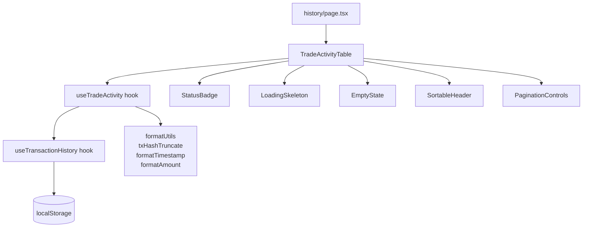
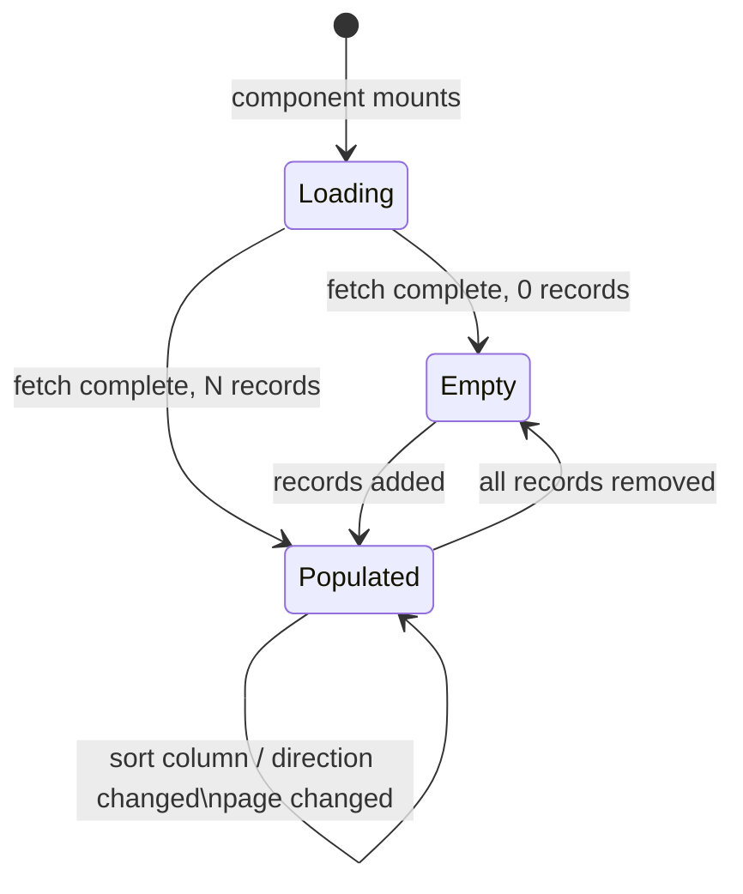

# Design Document: Trade Activity Table

## Overview

The Trade Activity Table is a self-contained React component that renders a paginated,
sortable list of a user's historical swap executions within the StellarRoute frontend.
It integrates with the existing `useTransactionHistory` hook (localStorage-backed) and
reuses the project's shadcn/ui primitives (`Table`, `Badge`, `Skeleton`, `Button`).

The component is composed of four distinct sub-concerns:

1. **Data layer** — a new `useTradeActivity` hook that adapts `TransactionRecord` data
   into the `TradeRecord` shape, applies sorting, and slices for pagination.
2. **Formatting utilities** — pure functions for TxHash truncation, timestamp
   formatting, and amount formatting.
3. **Presentational components** — `StatusBadge`, `LoadingSkeleton`, `EmptyState`,
   `SortableHeader`, `PaginationControls`, and the root `TradeActivityTable`.
4. **Accessibility layer** — `aria-sort`, `aria-label`, `<caption>`, keyboard
   event handling wired into the sortable headers and pagination controls.

The component will live at
`frontend/components/shared/TradeActivityTable.tsx` and be consumed by the existing
`frontend/app/history/page.tsx`.

---

## Architecture



State flow:



---

## Components and Interfaces

### TradeRecord (domain type)

```ts
export type TradeStatus = 'Pending' | 'Success' | 'Failed';

export interface TradeRecord {
  txHash: string;
  pair: string;        // e.g. "XLM/USDC"
  side: 'Buy' | 'Sell';
  amount: string;      // raw decimal string, e.g. "10.5"
  timestamp: Date;
  status: TradeStatus | string; // string allows unknown values
}
```

### SortColumn / SortDirection

```ts
export type SortColumn = 'timestamp' | 'amount' | 'status';
export type SortDirection = 'asc' | 'desc';

export interface SortState {
  column: SortColumn;
  direction: SortDirection;
}
```

### useTradeActivity hook

```ts
interface UseTradeActivityOptions {
  walletAddress: string | null;
  pageSize?: number; // default 20
}

interface UseTradeActivityResult {
  records: TradeRecord[];       // current page, sorted
  totalRecords: number;
  currentPage: number;
  totalPages: number;
  sortState: SortState;
  isLoading: boolean;
  setPage: (page: number) => void;
  setSortState: (sort: SortState) => void;
}
```

The hook:
- Reads from `useTransactionHistory` and maps `TransactionRecord` → `TradeRecord`
- Applies sort (pure comparison, no mutation)
- Slices the sorted array for the current page
- Resets `currentPage` to 1 whenever `sortState` changes

### TradeActivityTable props

```ts
interface TradeActivityTableProps {
  walletAddress: string | null;
  pageSize?: number;
}
```

### StatusBadge props

```ts
interface StatusBadgeProps {
  status: TradeStatus | string;
}
```

### SortableHeader props

```ts
interface SortableHeaderProps {
  column: SortColumn;
  label: string;
  sortState: SortState;
  onSort: (column: SortColumn) => void;
}
```

### PaginationControls props

```ts
interface PaginationControlsProps {
  currentPage: number;
  totalPages: number;
  onPageChange: (page: number) => void;
}
```

---

## Data Models

### Mapping TransactionRecord → TradeRecord

The existing `TransactionRecord` stores `fromAsset`/`toAsset` and a `TransactionStatus`
that uses lowercase strings. The mapping:

| TransactionRecord field | TradeRecord field | Notes |
|---|---|---|
| `hash` | `txHash` | Falls back to `id` if hash absent |
| `fromAsset + "/" + toAsset` | `pair` | e.g. `"XLM/USDC"` |
| Derived from quote type | `side` | `"Sell"` when selling fromAsset |
| `fromAmount` | `amount` | Raw decimal string |
| `new Date(timestamp)` | `timestamp` | Unix ms → Date |
| `status` (capitalised) | `status` | `"success"` → `"Success"` etc. |

### Sorting

Sorting is applied client-side over the full mapped array before pagination slicing.

| Column | Comparator |
|---|---|
| `timestamp` | `Date` numeric comparison |
| `amount` | `parseFloat` numeric comparison |
| `status` | Lexicographic string comparison |

Default: `{ column: 'timestamp', direction: 'desc' }`.

### Pagination

```
totalPages = Math.ceil(totalRecords / pageSize)
pageRecords = sortedRecords.slice((currentPage - 1) * pageSize, currentPage * pageSize)
```

Pagination controls are hidden when `totalRecords <= pageSize`.

### Formatting Utilities

```ts
// Pure functions in frontend/lib/trade-format.ts

/** Truncate a TxHash for narrow viewports */
function truncateTxHash(hash: string): string
// Returns hash.slice(0,8) + "…" + hash.slice(-4) for hash.length > 12

/** Format a Date as "YYYY-MM-DD HH:mm UTC" */
function formatTradeTimestamp(date: Date): string

/** Format an amount with up to 7 decimal places, no trailing zeros */
function formatTradeAmount(amount: string): string
// Uses trimTrailingZeros from existing lib/amount-input.ts

/** Build Stellar Expert explorer URL */
function stellarExplorerUrl(txHash: string): string
// Returns `https://stellar.expert/explorer/public/tx/${txHash}`
```

---

## Correctness Properties

*A property is a characteristic or behavior that should hold true across all valid
executions of a system — essentially, a formal statement about what the system should
do. Properties serve as the bridge between human-readable specifications and
machine-verifiable correctness guarantees.*

### Property 1: TxHash truncation format

*For any* TxHash string longer than 12 characters, `truncateTxHash` should return a
string equal to the first 8 characters, followed by `"…"`, followed by the last 4
characters.

**Validates: Requirements 1.2**

---

### Property 2: TxHash explorer URL

*For any* TxHash string, the rendered TxHash cell anchor's `href` should equal
`https://stellar.expert/explorer/public/tx/<txHash>` and the anchor should have
`target="_blank"`.

**Validates: Requirements 1.3**

---

### Property 3: Timestamp format

*For any* valid `Date` value, `formatTradeTimestamp` should return a string that matches
the pattern `YYYY-MM-DD HH:mm UTC` (i.e. matches `/^\d{4}-\d{2}-\d{2} \d{2}:\d{2} UTC$/`).

**Validates: Requirements 1.4**

---

### Property 4: Amount formatting

*For any* decimal amount string, `formatTradeAmount` should return a string with at most
7 decimal places and no trailing zeros after the decimal point.

**Validates: Requirements 1.5**

---

### Property 5: Status badge label and aria-label

*For any* `TradeStatus` value (including unrecognised strings), the rendered
`StatusBadge` should display the correct label (`"Pending"`, `"Success"`, `"Failed"`, or
`"Unknown"`) and have `aria-label="Trade status: <label>"`.

**Validates: Requirements 2.1, 2.2, 2.3, 2.4, 2.5**

---

### Property 6: Sorted order invariant

*For any* list of `TradeRecord` values and any `SortColumn`, after sorting ascending,
every consecutive pair of records `(a, b)` should satisfy `comparator(a, b) <= 0`; after
toggling to descending, every consecutive pair should satisfy `comparator(a, b) >= 0`.

**Validates: Requirements 5.2, 5.3**

---

### Property 7: Page size invariant

*For any* list of `TradeRecord` values with more than `pageSize` records, the number of
records on any non-last page should equal exactly `pageSize`, and the last page should
contain the remainder.

**Validates: Requirements 6.1**

---

### Property 8: Pagination visibility threshold

*For any* list of `TradeRecord` values, pagination controls should be hidden when
`totalRecords <= pageSize` and visible when `totalRecords > pageSize`.

**Validates: Requirements 6.5**

---

### Property 9: Sort change resets page

*For any* `SortState` change (column or direction), the `currentPage` should reset to 1
regardless of which page was previously active.

**Validates: Requirements 6.6**

---

### Property 10: Keyboard sort activation

*For any* sortable column header, pressing `Enter` or `Space` while the header is
focused should produce the same sort state change as a pointer click on that header.

**Validates: Requirements 7.3**

---

### Property 11: aria-sort correctness

*For any* active `SortState`, the active column header should have
`aria-sort="ascending"` or `aria-sort="descending"` matching the direction, and all
other sortable headers should have `aria-sort="none"`.

**Validates: Requirements 7.4**

---

## Error Handling

| Scenario | Behaviour |
|---|---|
| `localStorage` parse failure | `useTransactionHistory` already catches and returns `[]`; `TradeActivityTable` renders `EmptyState` |
| `TransactionRecord` with missing `hash` | Falls back to `id` for `txHash`; explorer link still renders |
| Unrecognised `TradeStatus` string | `StatusBadge` renders grey `"Unknown"` badge |
| `amount` that is not a valid number | `formatTradeAmount` returns the raw string unchanged |
| `walletAddress` is `null` | Hook returns empty records; component renders `EmptyState` |

---

## Testing Strategy

### Dual Testing Approach

Both unit tests and property-based tests are required. Unit tests cover specific
examples, integration points, and edge cases. Property tests verify universal
correctness across randomised inputs.

### Property-Based Testing Library

**[fast-check](https://github.com/dubzzz/fast-check)** — the standard PBT library for
TypeScript/JavaScript. Install with:

```bash
npm install --save-dev fast-check
```

Each property test runs a minimum of **100 iterations** (fast-check default is 100).

### Property Test Tags

Each property test must include a comment referencing the design property:

```
// Feature: trade-activity-table, Property N: <property_text>
```

### Property Tests

Each correctness property maps to exactly one property-based test:

| Property | Test file | fast-check arbitraries |
|---|---|---|
| P1: TxHash truncation | `trade-format.test.ts` | `fc.string({ minLength: 13 })` |
| P2: TxHash explorer URL | `TradeActivityTable.test.tsx` | `fc.hexaString({ minLength: 64, maxLength: 64 })` |
| P3: Timestamp format | `trade-format.test.ts` | `fc.date()` |
| P4: Amount formatting | `trade-format.test.ts` | `fc.float({ min: 0 })` mapped to string |
| P5: Status badge | `StatusBadge.test.tsx` | `fc.oneof(fc.constant('Pending'), fc.constant('Success'), fc.constant('Failed'), fc.string())` |
| P6: Sorted order invariant | `useTradeActivity.test.ts` | `fc.array(tradeRecordArb)` |
| P7: Page size invariant | `useTradeActivity.test.ts` | `fc.array(tradeRecordArb, { minLength: 21 })` |
| P8: Pagination visibility | `TradeActivityTable.test.tsx` | `fc.array(tradeRecordArb)` |
| P9: Sort resets page | `useTradeActivity.test.ts` | `fc.record({ column: sortColumnArb, direction: sortDirArb })` |
| P10: Keyboard sort | `TradeActivityTable.test.tsx` | `fc.constantFrom('timestamp','amount','status')` |
| P11: aria-sort correctness | `TradeActivityTable.test.tsx` | `fc.record({ column: sortColumnArb, direction: sortDirArb })` |

### Unit Tests

Unit tests focus on specific examples and edge cases not covered by property tests:

- Loading skeleton renders exactly 5 rows (Req 3.2)
- Skeleton is replaced by table/empty-state after fetch (Req 3.3)
- Empty state renders correct message text (Req 4.2)
- First page disables "previous" control (Req 6.3)
- Last page disables "next" control (Req 6.4)
- Default sort is Timestamp descending (Req 5.5)
- `<caption>` text is "Trade Activity" (Req 7.2)
- Semantic `<table>`, `<thead>`, `<tbody>` present (Req 7.1)
- Pagination controls have correct `aria-label` values (Req 7.5)
- `aria-sort` set on initial render (Req 5.4)

### Test File Layout

```
frontend/
  lib/
    trade-format.test.ts          # P1, P3, P4 + unit tests for formatting utils
  components/shared/
    StatusBadge.test.tsx          # P5
    TradeActivityTable.test.tsx   # P2, P8, P10, P11 + unit tests
  hooks/
    useTradeActivity.test.ts      # P6, P7, P9 + unit tests
```
