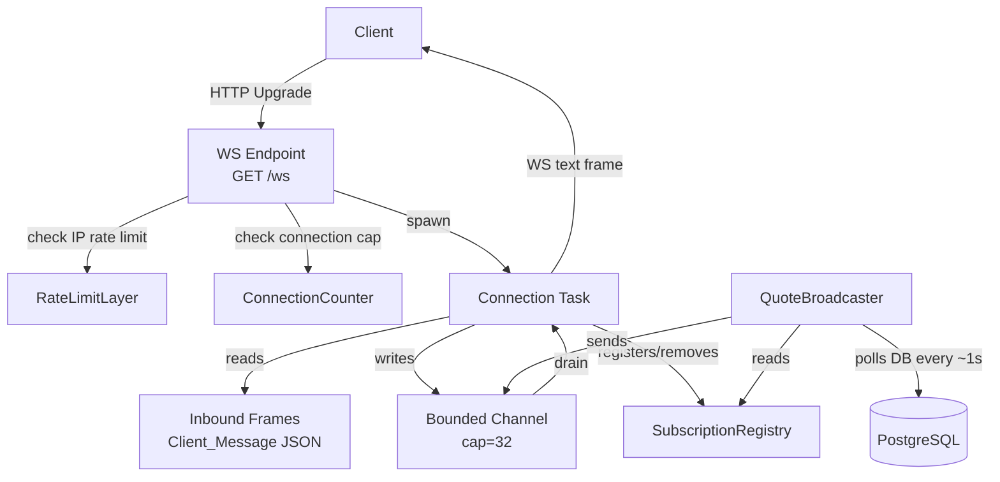

# Design Document: WebSocket Quote Stream

## Overview

This feature adds a WebSocket endpoint (`GET /ws`) to the StellarRoute API that pushes live quote updates to connected clients. Clients subscribe to specific trading pairs; the server fans out `QuoteUpdate` messages whenever the underlying liquidity data changes (detected via ledger revision polling). The design reuses existing infrastructure: `AppState`, the quote computation logic in `routes/quote.rs`, and the Redis-backed `RateLimitLayer`.

Key design goals:
- Minimal coupling — the WS handler is a new route module, not a rewrite of existing code.
- Backpressure by design — bounded per-connection channels with explicit drop policy.
- Operational safety — configurable connection cap, per-IP and per-connection rate limits, keepalive pings.

---

## Architecture



### Component Responsibilities

| Component | Responsibility |
|---|---|
| `WsHandler` | HTTP→WS upgrade, IP rate-limit check, connection cap enforcement |
| `ConnectionTask` | Per-connection async task: read client frames, write outbound frames, keepalive pings |
| `SubscriptionRegistry` | `Arc<Mutex<HashMap<ConnId, Vec<Subscription>>>>` — tracks active subscriptions |
| `QuoteBroadcaster` | Background task polling ledger revisions, computing quotes, fanning out updates |
| `ConnectionCounter` | `Arc<AtomicUsize>` — tracks live connection count against `WS_MAX_CONNECTIONS` |
| `MessageRateLimiter` | Per-connection sliding-window counter (60 msg/min) |

### Concurrency Model

- One `QuoteBroadcaster` task runs for the lifetime of the server.
- Each accepted WebSocket connection spawns one `ConnectionTask`.
- The `SubscriptionRegistry` is shared between all `ConnectionTask`s and the `QuoteBroadcaster` via `Arc<RwLock<...>>` (read-heavy workload).
- Each connection owns a `tokio::sync::mpsc::channel(32)` sender stored in the registry; the `ConnectionTask` holds the receiver.

---

## Components and Interfaces

### 1. WS Route Registration

```rust
// crates/api/src/routes/mod.rs  (addition)
.route("/ws", get(ws::ws_handler))
```

The handler signature:

```rust
pub async fn ws_handler(
    ws: WebSocketUpgrade,
    State(state): State<Arc<AppState>>,
    ConnectInfo(addr): ConnectInfo<SocketAddr>,
) -> impl IntoResponse
```

`axum::extract::ws::WebSocketUpgrade` handles the HTTP→WS upgrade. The handler checks the connection cap and IP rate limit before calling `.on_upgrade(...)`.

### 2. WsState (extension to AppState)

Rather than modifying `AppState` directly, a `WsState` struct is stored inside `AppState` behind an `Arc`:

```rust
pub struct WsState {
    pub registry: Arc<RwLock<SubscriptionRegistry>>,
    pub connection_counter: Arc<AtomicUsize>,
    pub max_connections: usize,           // from WS_MAX_CONNECTIONS env var, default 500
    pub ip_rate_limiter: Arc<Mutex<IpRateLimiter>>,  // 10 new conns/min per IP
}
```

`AppState` gains a field `pub ws: Option<Arc<WsState>>` — `None` when the WS feature is disabled.

### 3. SubscriptionRegistry

```rust
pub struct SubscriptionRegistry {
    // conn_id → (subscriptions, outbound_sender)
    connections: HashMap<ConnId, ConnectionEntry>,
}

pub struct ConnectionEntry {
    pub subscriptions: Vec<Subscription>,
    pub tx: mpsc::Sender<ServerMessage>,
}

pub struct Subscription {
    pub id: SubscriptionId,   // client-provided or server-generated UUID
    pub base: String,
    pub quote: String,
    pub amount: Option<String>,
    pub last_emitted_price: Option<f64>,  // for dedup / 0.01% threshold
}
```

### 4. Message Types

```rust
// Client → Server
#[derive(Deserialize)]
#[serde(tag = "action", rename_all = "snake_case")]
pub enum ClientMessage {
    Subscribe { subscription: SubscriptionRequest },
    Unsubscribe { subscription_id: SubscriptionId },
}

#[derive(Deserialize)]
pub struct SubscriptionRequest {
    pub base: String,
    pub quote: String,
    pub amount: Option<String>,
}

// Server → Client
#[derive(Serialize)]
pub struct ServerMessage {
    pub v: u8,                    // always 1
    pub timestamp: i64,           // Unix ms
    #[serde(flatten)]
    pub payload: ServerPayload,
}

#[derive(Serialize)]
#[serde(tag = "type", rename_all = "snake_case")]
pub enum ServerPayload {
    SubscriptionConfirmed { subscription_id: SubscriptionId },
    QuoteUpdate { subscription_id: SubscriptionId, quote: QuoteResponse },
    Error { code: String, message: String },
    Ping,
}
```

### 5. QuoteBroadcaster

The broadcaster runs as a `tokio::spawn`ed task started in `Server::new`. It:

1. Sleeps for a configurable poll interval (default 1 s).
2. Reads all active subscriptions from the registry (read lock).
3. For each unique `(base, quote)` pair, calls `get_liquidity_revision` to detect changes.
4. On change (or on first poll after subscription), calls the extracted `compute_quote` function from `routes/quote.rs`.
5. Applies dedup: skips emission if price unchanged; applies 0.01% threshold when `amount` is set.
6. Sends `ServerMessage` to each matching connection's `mpsc::Sender`.
7. If `send` returns `Err` (channel full / closed), applies drop policy (see Backpressure).

### 6. ConnectionTask

Each connection task runs a `tokio::select!` loop over:
- Inbound WS frames (client messages)
- Outbound channel receiver (server messages to send)
- Ping timer (every 30 s)
- Pong timeout watchdog (10 s after ping)
- Backpressure watchdog (channel-full duration > 10 s → close)

---

## Data Models

### ClientMessage (JSON)

```json
// Subscribe
{ "action": "subscribe", "subscription": { "base": "native", "quote": "USDC:ISSUER", "amount": "100" } }

// Unsubscribe
{ "action": "unsubscribe", "subscription_id": "uuid-v4" }
```

### ServerMessage (JSON)

All server messages share the envelope:

```json
{ "v": 1, "timestamp": 1700000000000, "type": "<type>", ...payload }
```

#### subscription_confirmed
```json
{ "v": 1, "timestamp": 1700000000000, "type": "subscription_confirmed", "subscription_id": "uuid-v4" }
```

#### quote_update
```json
{
  "v": 1,
  "timestamp": 1700000000000,
  "type": "quote_update",
  "subscription_id": "uuid-v4",
  "quote": { ...QuoteResponse }
}
```

#### error
```json
{ "v": 1, "timestamp": 1700000000000, "type": "error", "code": "no_route_found", "message": "..." }
```

Error codes:
| Code | Trigger |
|---|---|
| `unknown_action` | Unrecognised `action` field |
| `invalid_subscription` | Missing/malformed subscription object |
| `subscription_limit_exceeded` | >20 subscriptions per connection |
| `no_route_found` | No liquidity for subscribed pair |
| `rate_limit_exceeded` | >60 client messages/min |
| `backpressure_drop` | Oldest message dropped from full outbound channel |
| `connection_limit_exceeded` | Server at `WS_MAX_CONNECTIONS` (HTTP 503, not WS) |

### Environment Variables

| Variable | Default | Description |
|---|---|---|
| `WS_MAX_CONNECTIONS` | `500` | Maximum concurrent WebSocket connections |
| `WS_POLL_INTERVAL_MS` | `1000` | Broadcaster poll interval in milliseconds |
| `WS_PING_INTERVAL_SECS` | `30` | Keepalive ping interval |
| `WS_PONG_TIMEOUT_SECS` | `10` | Pong response timeout before disconnect |
| `WS_BACKPRESSURE_TIMEOUT_SECS` | `10` | Max seconds channel may be full before disconnect |

### File Layout

```
crates/api/src/
  routes/
    ws/
      mod.rs          # ws_handler, upgrade logic, connection cap
      connection.rs   # ConnectionTask, per-connection state machine
      messages.rs     # ClientMessage, ServerMessage, ServerPayload types
      registry.rs     # SubscriptionRegistry, ConnectionEntry, Subscription
      broadcaster.rs  # QuoteBroadcaster background task
      rate_limit.rs   # Per-connection message rate limiter
crates/api/tests/
  ws_integration.rs   # Integration tests (Req 7)
```

---

## Correctness Properties

*A property is a characteristic or behavior that should hold true across all valid executions of a system — essentially, a formal statement about what the system should do. Properties serve as the bridge between human-readable specifications and machine-verifiable correctness guarantees.*


### Property 1: ServerMessage envelope invariant

*For any* `ServerMessage` produced by the system, the `v` field must equal `1` and the `timestamp` field must be a positive integer representing Unix milliseconds.

**Validates: Requirements 3.1, 3.5**

---

### Property 2: ServerMessage serialization round-trip

*For any* `ServerMessage` value (across all payload variants), serializing it to JSON and deserializing it back must produce a value equivalent to the original.

**Validates: Requirements 3.2, 7.6**

---

### Property 3: Subscribe produces subscription_confirmed

*For any* valid subscription request (non-empty base and quote strings), sending a `subscribe` action must result in a `subscription_confirmed` response containing a `subscription_id`.

**Validates: Requirements 2.1**

---

### Property 4: Subscribe then unsubscribe removes subscription

*For any* subscription, after subscribing and then unsubscribing with the returned `subscription_id`, the subscription registry must contain no entry for that `subscription_id` on that connection.

**Validates: Requirements 2.2, 7.4**

---

### Property 5: Unknown action returns error

*For any* string that is not a recognised `action` value (`subscribe` or `unsubscribe`), the server must respond with a `ServerMessage` of type `error` with `code: "unknown_action"`.

**Validates: Requirements 2.3**

---

### Property 6: Malformed subscription returns error

*For any* client message with `action: "subscribe"` but a missing or structurally invalid `subscription` object, the server must respond with a `ServerMessage` of type `error` with `code: "invalid_subscription"`.

**Validates: Requirements 2.4**

---

### Property 7: Connection cleanup on close

*For any* WebSocket connection that has been closed (by either party), the subscription registry must contain no entries for that connection's ID, and the connection counter must have been decremented.

**Validates: Requirements 1.5, 2.6**

---

### Property 8: Amount-based dedup threshold

*For any* two consecutive price values `p1` and `p2` where `|p2 - p1| / p1 <= 0.0001` (0.01%), the dedup predicate must return `false` (do not emit). When `|p2 - p1| / p1 > 0.0001`, it must return `true` (emit).

**Validates: Requirements 2.7, 4.4**

---

### Property 9: Initial quote_update on subscribe

*For any* valid subscription to a pair that has liquidity data, the first message received after `subscription_confirmed` must be a `quote_update` for that subscription.

**Validates: Requirements 4.3**

---

### Property 10: Backpressure drop policy

*For any* connection whose outbound channel is at capacity (32 messages), attempting to send an additional message must result in the oldest message being dropped and a `backpressure_drop` error message being queued as the next outbound message.

**Validates: Requirements 6.1, 6.2**

---

### Property 11: Backpressure timeout closes connection

*For any* connection whose outbound channel has remained continuously full for more than 10 seconds, the connection state machine must transition to the `closing` state and emit WebSocket close code `1008`.

**Validates: Requirements 6.3**

---

### Property 12: Ping/pong timeout closes connection

*For any* connection where a ping has been sent and no pong is received within 10 seconds, the connection state machine must transition to the `closing` state.

**Validates: Requirements 6.4**

---

## Error Handling

### Upgrade-time errors

| Condition | Response |
|---|---|
| Connection cap reached | HTTP 503, JSON `{"error": "connection_limit_exceeded", "message": "..."}` |
| IP rate limit exceeded | HTTP 429 (via existing `RateLimitLayer`) |
| Invalid upgrade request | HTTP 400 (Axum default) |

### Post-upgrade errors (WS messages)

All post-upgrade errors are sent as `ServerMessage` with `type: "error"` and an appropriate `code`. The connection is only closed for:
- `rate_limit_exceeded` (close code 1008)
- Backpressure timeout (close code 1008)
- Pong timeout (close code 1001 Going Away)

For all other errors (unknown action, invalid subscription, subscription limit, no route found, backpressure drop notification), the connection remains open.

### Broadcaster errors

- If `compute_quote` returns `ApiError::NoRouteFound`, the broadcaster sends `error { code: "no_route_found" }` to the affected subscriber.
- If `compute_quote` returns any other error, the broadcaster logs a warning and skips that subscription for the current poll cycle (does not close the connection).
- If a connection's `mpsc::Sender` is closed (connection dropped), the broadcaster removes the connection from the registry.

### Panic safety

The `QuoteBroadcaster` task is wrapped in a `tokio::spawn` with a restart loop — if it panics, it is restarted after a 1-second delay with a logged error.

---

## Testing Strategy

### Dual Testing Approach

Both unit tests and property-based tests are required. They are complementary:
- Unit tests cover specific examples, integration scenarios, and error conditions.
- Property-based tests verify universal invariants across randomly generated inputs.

### Property-Based Testing

The property-based testing library for this Rust project is **`proptest`** (crate `proptest = "1"`).

Each property test must run a minimum of **100 iterations** (proptest default is 256, which satisfies this).

Each property test must include a comment tag in the format:
```
// Feature: websocket-quote-stream, Property N: <property_text>
```

Property-to-test mapping:

| Property | Test location | Test name |
|---|---|---|
| P1: Envelope invariant | `routes/ws/messages.rs` (unit) | `prop_server_message_envelope_fields` |
| P2: Serialization round-trip | `routes/ws/messages.rs` (unit) | `prop_server_message_round_trip` |
| P3: Subscribe → confirmed | `tests/ws_integration.rs` | `prop_subscribe_returns_confirmed` |
| P4: Subscribe/unsubscribe removes entry | `routes/ws/registry.rs` (unit) | `prop_subscribe_unsubscribe_removes_entry` |
| P5: Unknown action → error | `routes/ws/connection.rs` (unit) | `prop_unknown_action_returns_error` |
| P6: Malformed subscription → error | `routes/ws/connection.rs` (unit) | `prop_malformed_subscription_returns_error` |
| P7: Connection cleanup | `routes/ws/registry.rs` (unit) | `prop_connection_cleanup_on_close` |
| P8: Dedup threshold | `routes/ws/broadcaster.rs` (unit) | `prop_dedup_threshold` |
| P9: Initial quote_update | `tests/ws_integration.rs` | `prop_initial_quote_update_on_subscribe` |
| P10: Backpressure drop | `routes/ws/connection.rs` (unit) | `prop_backpressure_drop_policy` |
| P11: Backpressure timeout | `routes/ws/connection.rs` (unit) | `prop_backpressure_timeout_closes` |
| P12: Ping/pong timeout | `routes/ws/connection.rs` (unit) | `prop_pong_timeout_closes` |

### Unit Tests (specific examples and edge cases)

Located in `crates/api/tests/ws_integration.rs` and inline in module files:

| Test | Validates |
|---|---|
| `test_ws_upgrade_succeeds` | Req 1.1, 1.2 |
| `test_connection_limit_returns_503` | Req 1.3, 5.3 (edge case: max_connections=1, fill then reject) |
| `test_subscribe_invalid_pair_returns_no_route` | Req 4.5, 7.2 |
| `test_subscription_limit_exceeded` | Req 2.5, 7.3 (edge case: 21st subscription) |
| `test_full_lifecycle` | Req 7.1 |
| `test_message_rate_limit_closes_connection` | Req 5.2, 7.5 |
| `test_ip_rate_limit_rejects_connections` | Req 5.1 (edge case: 11th connection from same IP) |
| `test_channel_capacity_is_32` | Req 6.1 |

### Integration Test Setup

Integration tests use `axum::test` helpers with an in-memory SQLite or a test Postgres instance (matching the existing pattern in `tests/quote_integration.rs`). WebSocket client connections use the `tokio-tungstenite` crate.
